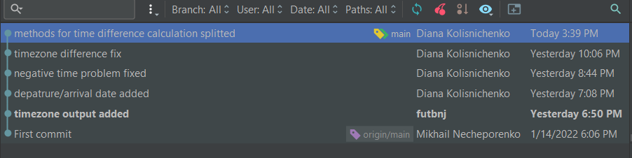
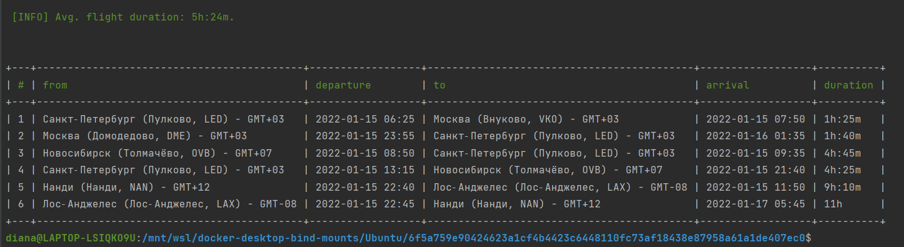

###ФИО
Колисниченко Диана 

###Потраченное на тестовое задание время
Общее потраченное время - около 4х часов с момента клонирования репозитория,
детально можно посмотретить по времени коммитов:    
 

###Скриншот вывода консольной команды
 

###Описание принятых решений
Проблема: при подсчете продолжительности полета не учитываются часовые пояса аэропортов
и даты вылета/прилета

Решение:
* Получила данные вылета/прилета, приобразовала дату и время в объект DateTime, чтобы легко посчитать
  разницу через метод diff, который возващает объект DateInterval со свойствами и значениями описывающими
  разницу в годах/месяцах/днях/минутах/секундах между двумя объектами DateTime. Еще он возвращает
  свойство invert со значением 1, если интервал отрицательный, и 0 - если положительный.
* Проверила не может ли он посчитать
  разницу если к DateTime добавить DateTimeZone object - может, но не всегда :)
* Распарсила строку с часовым поясом до числового значения, нашла разницу во времени между аэропортами, перевела в минуты
* Перевела интервал в минуты, если он отрицательный - умножается на -1
* Продолжительность перелета складывается из суммы интервала и разницы во времени